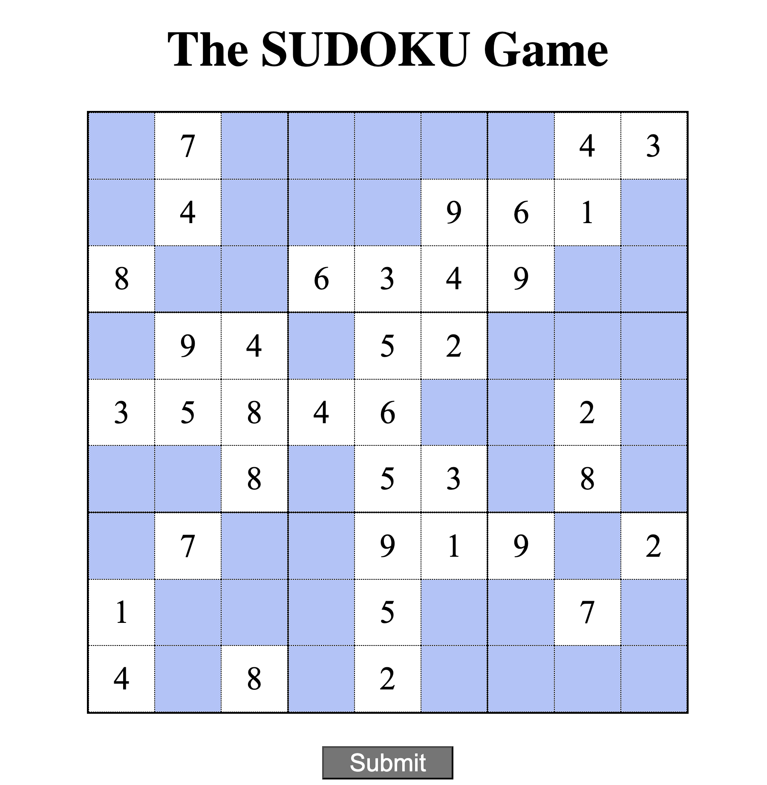

# Sudoku

- Basic version of sudoku implementation using HTML, Javascript and SCSS. Gives basic understanding of html, javascript and SCSS
- Goal - To build a sudoku solving and learning platform
- Prod version of this repo with more backend support will be pushed on private repository

# Screenshot of webpage 

